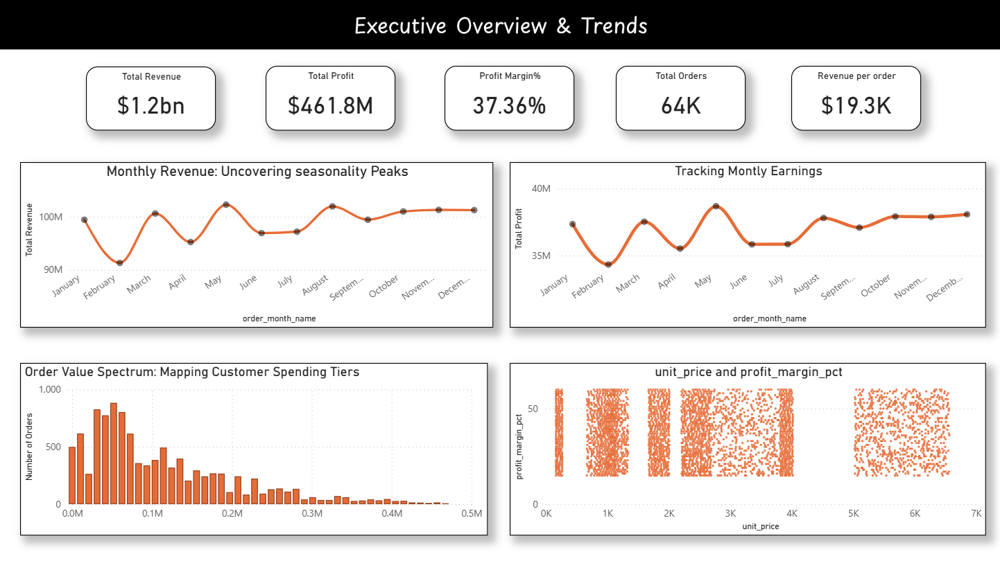
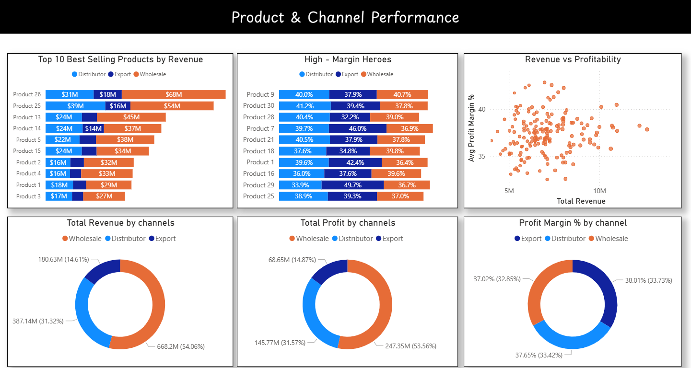
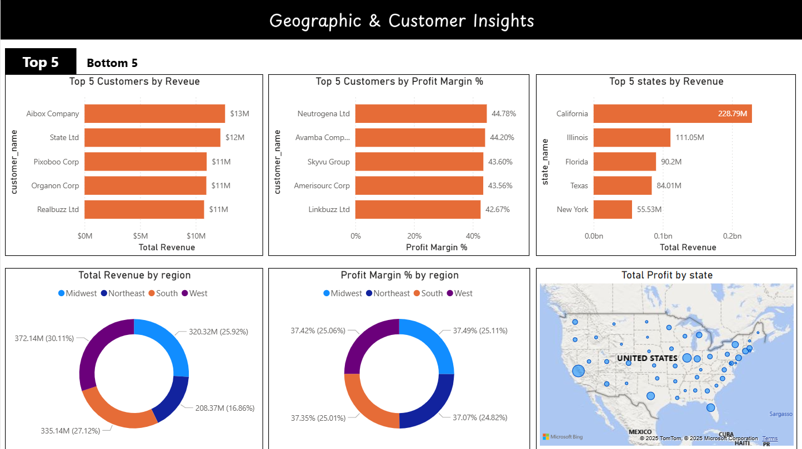

<h2>
USA Regional Sales Analysis Dashboard
</h1> 

## Overview
This project analyzes Zonal corp US sales data (2020–2024) to identify key revenue and profit drivers across products, channels, and regions. It uncovers seasonal trends, outliers, and alignment with budgets to inform pricing, promotion, and market-expansion strategies.

## Business Objectives
- Identify top-performing products, channels, and regions driving revenue and profit
- Uncover seasonal trends and anomalies for optimized planning
- Spot pricing and margin risks from outlier transactions
- Provide actionable insights via an interactive Power BI dashboard

## Data Source
Publicly available Excel files containing sales, customers, products, regions, state–region mapping, and budgets.

## Tech Stack
- **Python (Pandas, NumPy, Matplotlib, Seaborn)** – Data cleaning, feature engineering, exploratory      data analysis
- **Power BI** – Interactive dashboards and visualization

## Workflow
1. Define business objectives
2. Collect and consolidate data
3. Data loading and initial exploration
4. Pre-processing & cleaning
5. Feature engineering
6. Exploratory Data Analysis (EDA)
7. Dashboard creation & recommendations

## Pre-processing & Feature Engineering
- Set header rows for tables and merge Sales, Customers, Products, Regions, State–Region & Budgets
- Dropped redundant columns and standardized column names
- Selected key columns for analysis and renamed them sensibly
- Created `profit` and `profit_margin_pct` columns
- No missing values or duplicate rows found

## Final Dataset Structure
- **Identifiers:** order_number, order_date, customer_name, channel, product_name
- **Financials:** quantity, unit_price, revenue, cost, profit, profit_margin_pct
- **Calendar:** order_month_name, order_monnth_num, order_month
- **Geography:** state (code), state_name, us_region, lat, lon
- **Planning:** budget(2023)

## Key Insights
- Pronounced seasonality: January revenues ~$124 M, dipping to ~$95 M in April
- SKU Concentration: Products 26 & 25 drive ~25 % of total sales
- Channel Trade-Off: Wholesale captures 54 % of volume; Export leads with ~38 % margin
- Geographic Dominance: California alone logs 7.6K orders ($230 M); West region shows largest swings
- Top customers: Aibox Company and State Ltd by revenue

## Dashboard Overview
The Power BI report is organized into three interactive pages designed to deliver both high-level and granular insights:

**1. Executive Overview & Trends:** Summarizes key KPIs (Revenue, Proit, Margin%, Orders) and visualizes monthly performance and customer spend distribution.

**2. Product & Channel Performance:** Highlights top-performing products, channels, and profitability trade-offs to inform pricing and sales strategies.

**3. Gregraphic & Customer Insights:** Maps revenue and profit trends across U.S. regions, identifies high and low-value customers, and visualizes regional performance.

Dynamic filters, toggle buttons, and calculated measures enhance interactivity and enable deeper analysis.

## Business Value
- Supports strategic decision-making by revealing revenue and profit drivers
- Highlights regional and product trends for optimized planning
- Identifies customer segments and pricing/margin risks
- Enables actionable recommendations via interactive dashboards

## Executive Overview & Trends

## Product and Channel Performance

## Geographic and customer Insights

